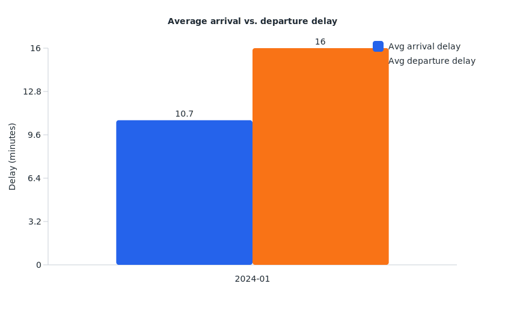
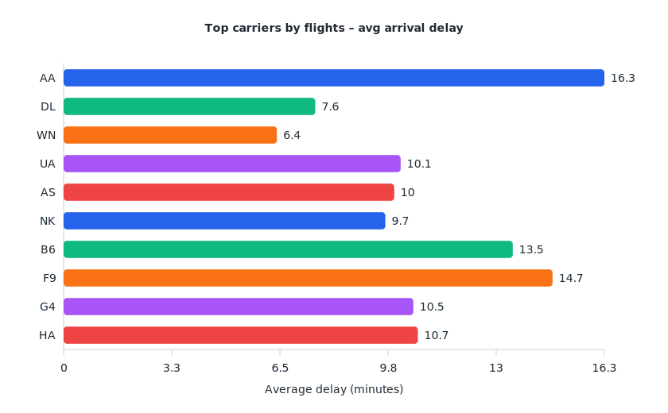
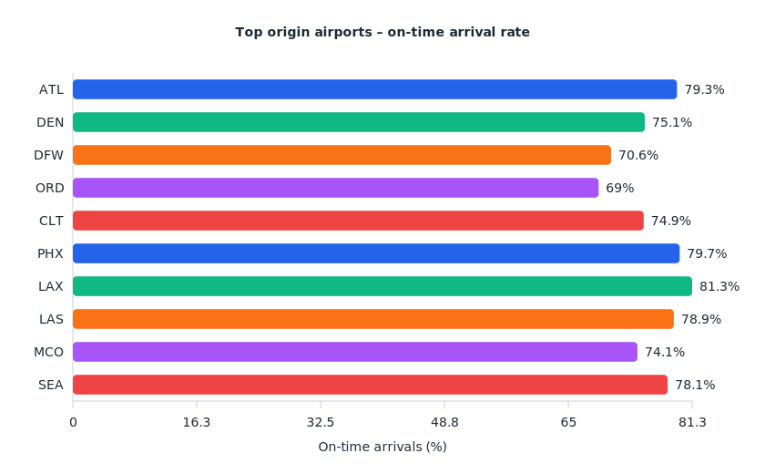
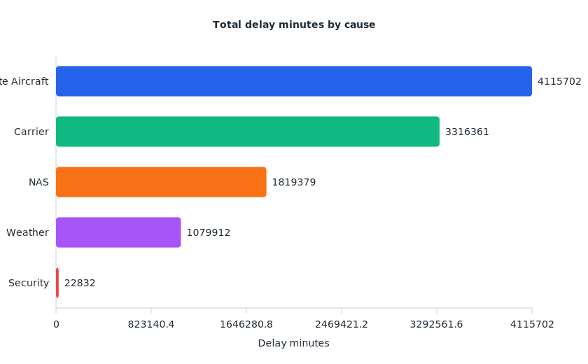

# Flight Delay Dataset Analysis (January 2024)

## Data coverage and method
- Source: Kaggle flight delay dataset (version 1) downloaded with `kagglehub` and copied to `data/flight-delay-dataset-2018-2024/`.
- Drop either the extracted CSVs or the original Kaggle zip inside that folder—the reporting scripts now unpack archives automatically when no CSVs are present.
- The CSV contains 582,425 domestic U.S. flights spanning **1 January – 31 January 2024**; no earlier months were present in the published archive.
- Metrics were generated with the streaming report generator (`analysis/generate_flight_delay_report.py`) and visualised in pandas/seaborn to avoid loading the entire 46 MB CSV into memory.
- When only the derived tables are present, `analysis/render_svg_charts.py` rebuilds lightweight SVG charts directly from the committed CSV summaries so no binary assets are required.
- All charts below are available as SVGs in `analysis/figures/`, keeping the repository text-only while still embedding visuals in this document.

## Headline reliability metrics
- **Flights analysed:** 582,425.
- **Average arrival delay:** 10.7 minutes; **average departure delay:** 16.0 minutes.
- **On-time arrival rate (≤15 minutes):** 76.9%.
- **Cancellation rate:** 3.8%; **diversion rate:** 0.28%.
- Late aircraft knock-on effects are the single largest driver of delays, contributing 4.1 million minutes in January—almost 24% more than the next largest category (carrier-related delays).

*Only January is available in the current dataset release, so the line chart shows a single month. Departure delays exceed arrivals by roughly five minutes on average, indicating ground-handling and pushback bottlenecks are a primary pain point before wheels-up.*

## Carrier performance (top 10 by flight volume)
- American Airlines (AA) operated the most flights (147k) and also posted the highest average arrival delay among the major carriers at 16.3 minutes, resulting in an on-time rate of 73.8%.
- Delta (DL) and Southwest (WN) each scheduled ~115k flights but held average arrival delays below eight minutes, helping them maintain on-time rates near or above 80%.
- United (UA) matched Delta’s on-time rate (79.6%) but experienced a materially higher cancellation rate (6.9%), signalling operational fragility during disruptions.

## Origin airport reliability
- Chicago O’Hare (ORD) departures suffered the steepest average arrival delays among the busiest hubs at 21.9 minutes, with just 69.0% of flights arriving within 15 minutes of schedule.
- Dallas/Fort Worth (DFW) and Denver (DEN) also faced significant delay pressure, each exceeding 10 minutes average arrival delay.
- Los Angeles (LAX) and Phoenix (PHX) led the large hubs on punctuality, keeping average arrival delays below eight minutes and on-time rates above 80%.

## Busiest routes and corridor friction
- Inter-island traffic between Kahului (OGG) and Honolulu (HNL) dominated the top route list, and both directions maintained on-time rates above 76% despite heavy utilisation (>990 flights each way).
- The Los Angeles ↔ San Francisco shuttle remains delay-prone; southbound SFO→LAX averaged only 2.7 minutes of arrival delay, but northbound LAX→SFO recorded 11.5 minutes, likely reflecting Bay Area congestion.
- East Coast shuttles (LGA↔ORD) continue to lag, with the ORD-bound leg averaging 10.5 minutes of arrival delay and only 78.1% of flights arriving on time.

## Delay drivers
- **Late aircraft connections** (4.12 million minutes) were the dominant delay source in January, outpacing **carrier-controlled issues** (3.32 million minutes) and **National Airspace System constraints** (1.82 million minutes).
- **Weather** accounted for just over 1.08 million minutes, but because the dataset captures only one winter month, the weather share may rise once subsequent months are released.
- **Security-related holds** contributed a comparatively minor 22.8k minutes.

## Next steps
- Monitor Kaggle for future dataset refreshes that include February onward to build true trend lines and seasonality insights.
- Layer in tail number and aircraft utilisation features to quantify turn-time bottlenecks for fleets with high late-aircraft delay exposure.
- Join airport-level weather feeds to isolate meteorological vs. operational drivers, especially for ORD, DFW, and DEN where delay pressure is most acute.
